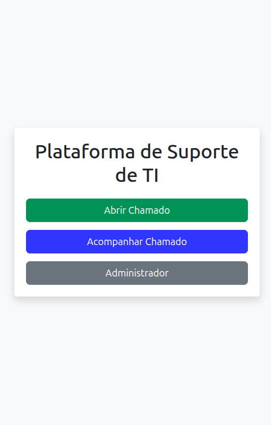
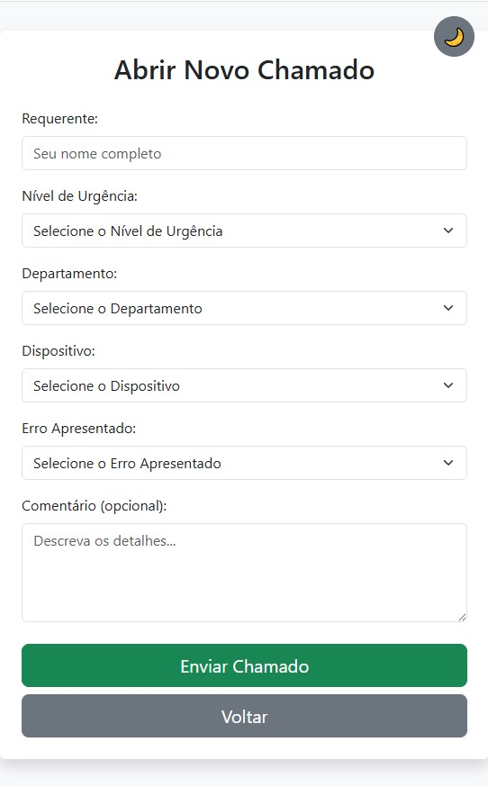
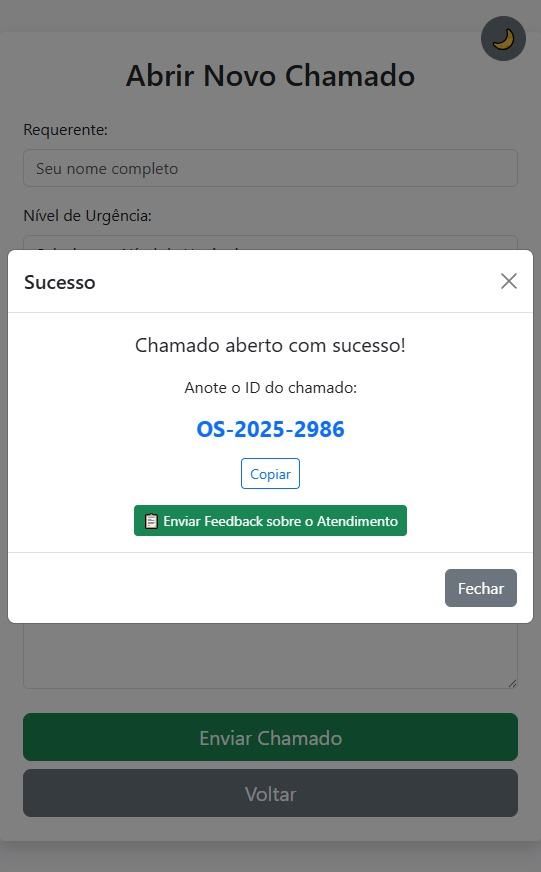
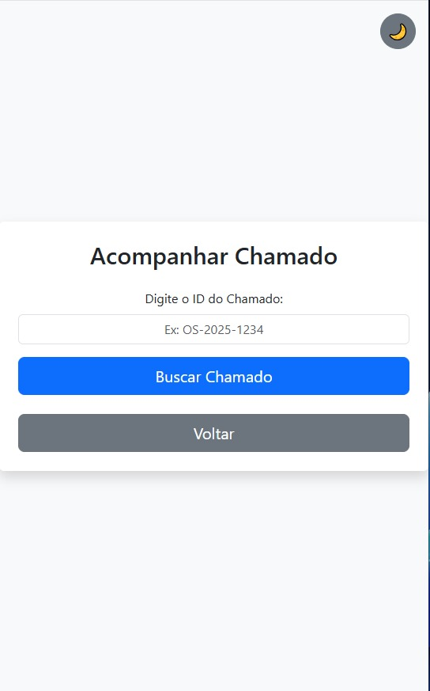
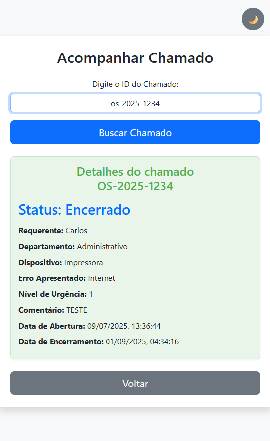

# 🛠️ Sistema de Abertura de Chamados - TI

Este é um projeto pessoal de **abertura de chamados técnicos**, desenvolvido com foco em uso próprio e como parte do meu portfólio.  
A ideia é oferecer uma solução simples e funcional para registrar solicitações de suporte de forma organizada e prática. 📋💡

> 💡 O sistema está **disponível para testes gratuitamente** em:  
👉 [http://bradoke.serv00.net](http://bradoke.serv00.net) — hospedado no servidor [serv00.net](http://serv00.net)

---

## 📌 Funcionalidades

✅ Formulário de abertura de chamado com:
- Título
- Descrição
- Categoria

✅ Registro automático de data e hora 🕒  
✅ Listagem de chamados abertos com status  
✅ Atualização do status (Aberto, Em andamento, Resolvido) 🔄  
✅ Interface simples, responsiva e intuitiva 👨‍💻📱  
✅ Armazenamento em banco de dados MySQL 💾

---

## 🧰 Tecnologias Utilizadas

- 🧱 **HTML5**
- 🎨 **CSS3**
- 🐘 **PHP (vanilla)**
- 🗃️ **MySQL**

---

## 🖼️ Demonstração

Abaixo, algumas telas do sistema em funcionamento:

Página inicial:
<p align="center">
  
  
</p>
Página abertura de chamado:
<p align="center">
  
  
</p>
Página acompanhar de chamado:
<p align="center">
  
  
</p>

---

## 🚀 Como Executar Localmente

1. 🔽 Clone o repositório:
   ```bash
   git clone https://github.com/eduardonicioli/pageOS.git
